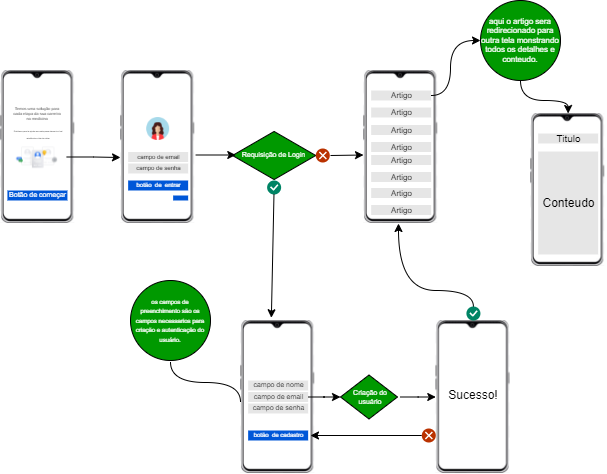
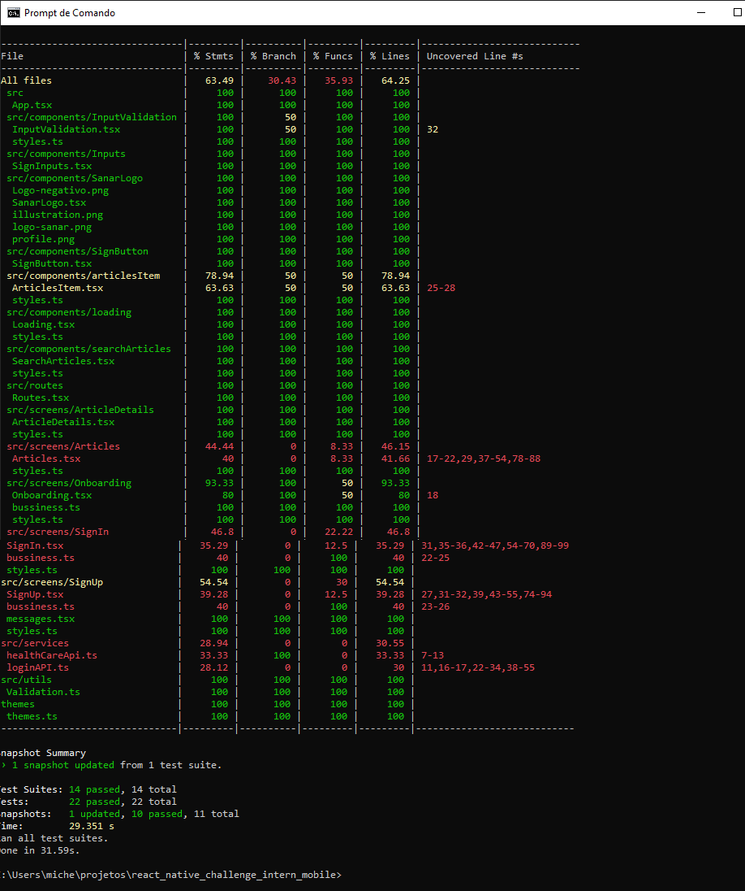

# Sanar Intern Challenge Mobile

  

## Estruturas de pastas

cada tela 1 arquivo principal, 1 arquivo de estilos, 1 de logica quando se aplicar,
arquivos que necessitam de testes, tera o arquivo test.

o codigo foi divido em blocos components, rotas, telas, serviços, utils.

## configurando telas principais

utilização de biblioteca styled components - para deixar o ambiente de estilização mais limpo.

criação temas e cores

1° design de temas e cores das 3 principais telas foi obtido atraves da plataforma figma 
https://www.figma.com/file/U67le6ZsSSb0XOgU4F7COC/Est%C3%A1gio-%2F-2022.1?node-id=0%3A1
as demais foram desenvolvida visando uma mairo facilidade de entendimento do usuário(a).

2° componentes - criado para uma melhor legibilidade, facilidade no entendimento, reaproveitamento

3° camadas bussiness - criada para separar as responsabilidades de regras e views

4° criação utils - armazenar todas nossas funções de validações em um arquivo separado.

## configuração ambiente testes

para configurar o ambiente de teste
foi utilizados algumas referências:

1° https://www.reactnativeschool.com/setup-jest-tests-with-react-navigation

2° configuração do ambiente de teste com jest
utilização da documentação para resolver o problema jest-config-is-throwing-type-errorhandler-error-mixed-isfatal-boolean
https://stackoverflow.com/questions/66652403/

3°utilização da documentação para resolver problema de mocks na biblioteca de navegação
https://reactnavigation.org/docs/testing/

## inserindo autenticadores

1° verificação com authenticadores para uma melhor performace
para que o usuário(a) consiga acessar os conteudos de artigos ele precisa se cadastrar e autenticar seu login com os dados validos, pois os autenticadores bloquearam seu acesso caso o seu login não seja valido.

1° para inserção dos autenticadores utilizamos regex,
algumas referências utilizadas.
https://pt.stackoverflow.com/questions/1386/express%C3%A3o-regular-para-valida%C3%A7%C3%A3o-de-e-mail
https://support.bettercloud.com/s/article/Creating-your-own-Custom-Regular-Expression-bc72153

utilização da plataforma regex para validar os campos de email e senha com padrões regex.
https://regex101.com/

3° pesquisa para resolução de problemas com regex.
https://stackoverflow.com/a/18812336/6273003

## inserindo logica de autenticação

criação do usuario, e autenticação com login.

1° consumo da API de login
para utilização da autenticação por login, foi necessario implementar uma logica assincrona onde pega-se o componente doLoginRequest e verifica-se email e senha, se forem são valídos seu estado será OK, caso não FORBIDDEN, sabendo se o usuário foi autenticado ou não.

a criação de usuário foi necessário utlizar lógica assincrona onde pega-se o componente doCreateUser faz o input dos dados utilizados no campo de verificação caso retorne o estado OK, todos os dados estão validos sera criado o usuário.

## testes unitarios 

**SnapShots**

Os testes foram adicionados para garantir que todos os valores capturados sejam usados sempre que o objetivo é testar se a saída é correta.

**Unitarios**

Testes unitários foram feitos para verificar e garantir o correto funcionamento da aplicação de forma automatizada. Nos permitindo fazer refatorações, novas funcionalidades e mudanças.

**Cobertura de testes**

  

## Icon and Splash
inserção icon and splash_screen

## bugs
apis não está olhando para email está somente olhando somente para senha